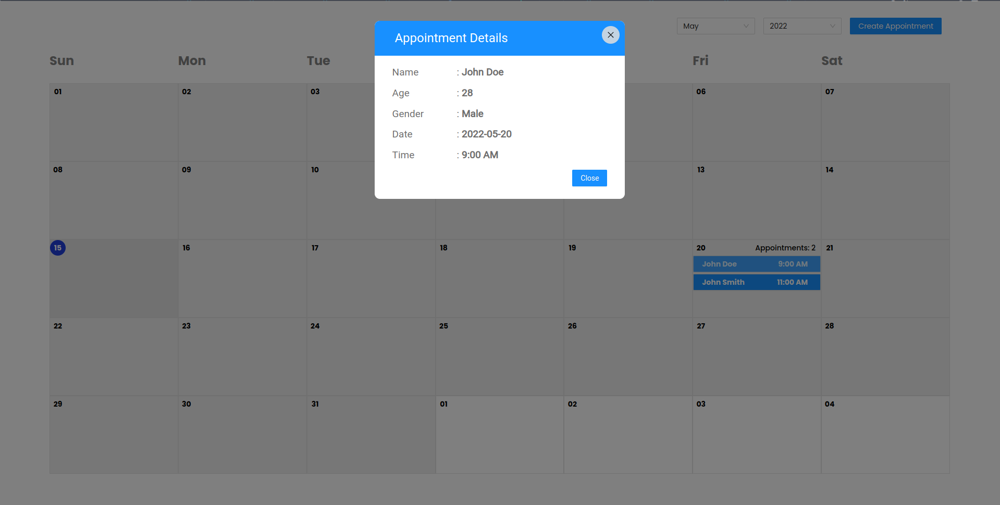

<br />
<p align="center">
  <h1 align="center"><a href="https://github.com/Sazzad-Anwar/doctor-appointment-app">Doctor Booking Application (Frontend)</a></h1>
</p>

This is one page application for booking appointment of doctor using monthly viewable calendar. This application is developed using `ReactJS`, `Redux`,`Redux Toolkit` & `Ant Design`. Appointment can be booked by filling a form with name, age, gender, date and time.



# Libraries

-   `React.js`
-   `Redux`
-   `Redux Toolkit`
-   `Ant Design`
-   `Dayjs`
-   `React-hook-form`
-   `React-icons`
-   `Styled Components`
-   `Uuid`

# Installation

To install and run the application locally you need `node.js` to be installed on your system. Then follow the steps below.

```bash
npm install
```

or using `yarn`

```bash
yarn
```

After installing the dependencies, you can run the application by running the following command.

```bash
npm run preview
```

or using `yarn`

```bash
yarn preview
```

## Browsing the application

After the installation and running the application, you can browse the application by opening the browser and typing the following URL.

```bash
http://localhost:4173
```
